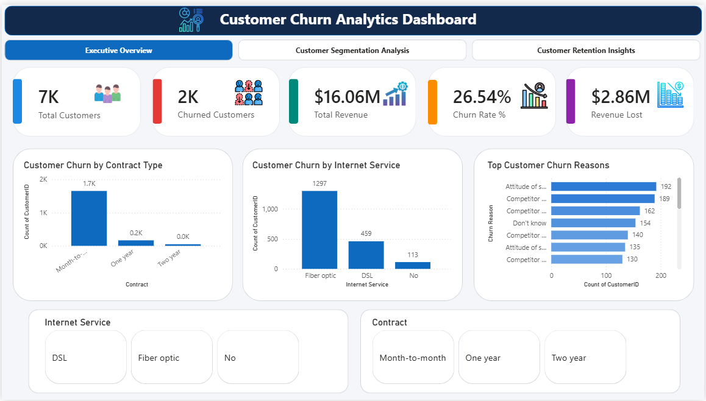
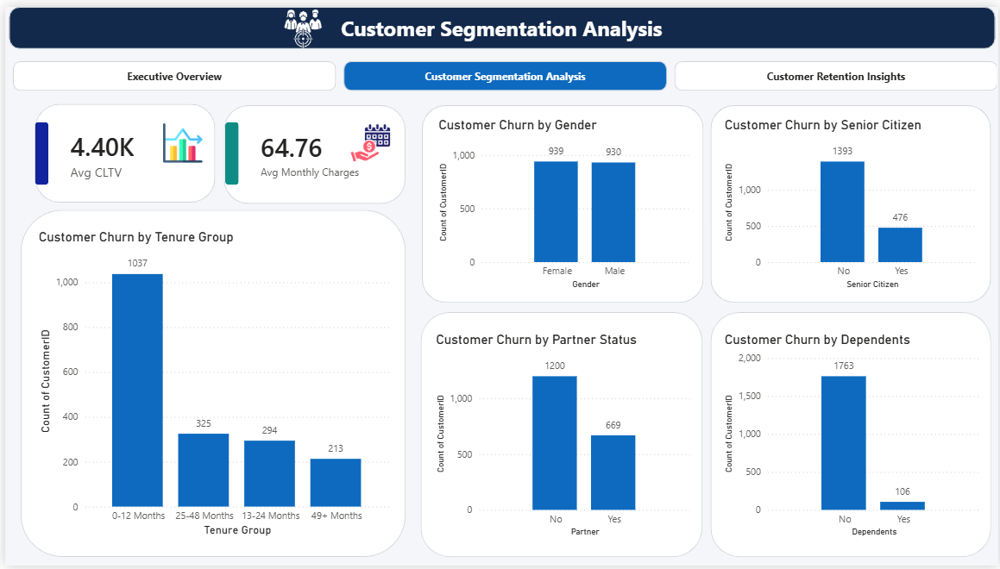
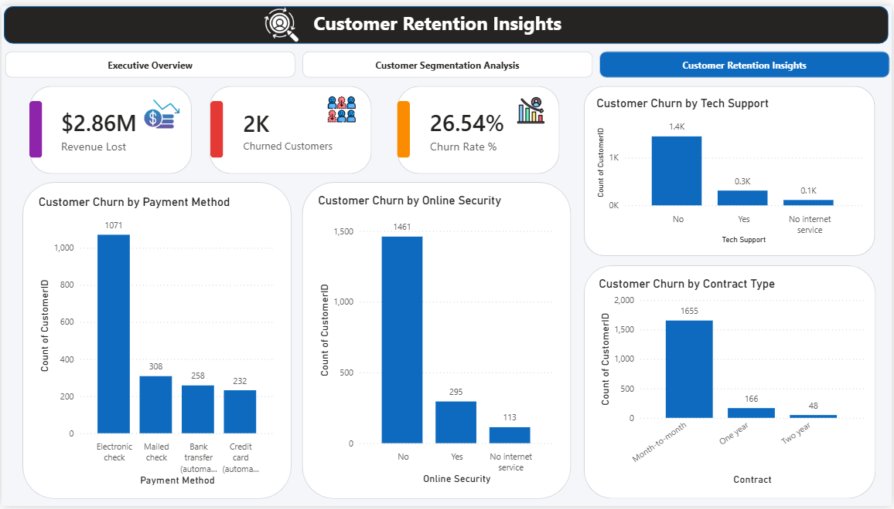

# 📊 Customer Churn Analytics Dashboard

## 📌 Project Overview
This Power BI project analyzes customer churn behavior and identifies the major factors affecting customer retention, churn rate, and revenue loss.

## 🎯 Project Objectives
- Analyze customer churn patterns
- Identify high-risk customer segments
- Understand revenue impact due to churn
- Discover retention opportunities

## 📈 Dashboard Pages

### 🏠 Executive Overview
- 👥 Total Customers
- 🚪 Churned Customers
- 📉 Churn Rate %
- 💰 Total Revenue
- 💸 Revenue Lost
- 📑 Contract Type Analysis
- 🌐 Internet Service Analysis
- 🔍 Top Churn Reasons

### 👥 Customer Segmentation Analysis
- 💎 Average CLTV
- 💳 Average Monthly Charges
- 🚻 Gender Analysis
- 👴 Senior Citizen Analysis
- ⏳ Tenure Analysis
- ❤️ Partner Status
- 👨‍👩‍👧 Dependents Analysis

### 🎯 Customer Retention Insights
- 💸 Revenue Lost Analysis
- 📉 Churn Rate Analysis
- 💳 Payment Method Analysis
- 🔐 Online Security Analysis
- 🛠️ Tech Support Analysis
- 📑 Contract Type Analysis

## 🛠️ Tools Used
- Power BI Desktop
- Power Query
- DAX
- Data Modeling
- Data Visualization

## 🔑 Key Insights
✅ Month-to-month customers have the highest churn.

✅ Customers without Tech Support are more likely to churn.

✅ Customers without Online Security show higher churn rates.

✅ Revenue loss due to churn exceeds **$2.86M**.

## 📸 Dashboard Screenshots

### 🏠 Executive Overview

### 👥 Customer Segmentation Analysis

### 🎯 Customer Retention Insights

## 📂 Repository Structure

Customer-Churn-Dashboard/
│
├── 📁 dataset
├── 📁 PBIX
├── 📁 Screenshots
└── 📄 README.md

## 👨‍💻 Author
**Vamsitha**

Power BI Developer | Data Analyst
